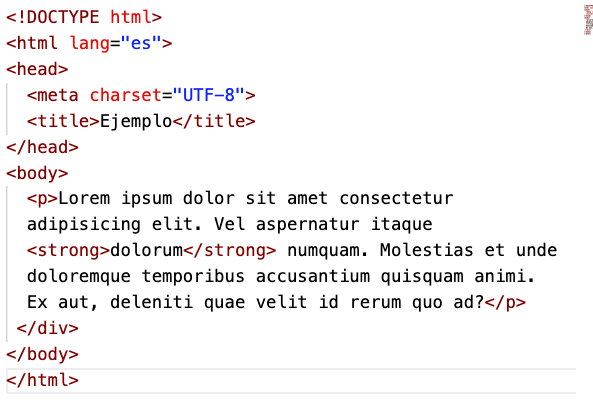
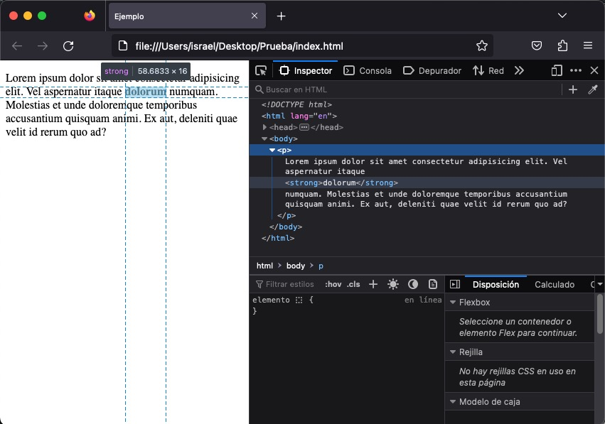

# 02. Ejercicios de División semántica del cuerpo, elementos de bloque y atributos

Los ejercicios se almacenarán en ficheros independientes en vuestro repositorio personal.

Cada ejercicio se guardará en un fichero con el nombre que se indica en el enunciado, dentro de una carpeta que se llamará `UT2\EC\02`.

### Ejercicio 10

Nombre fichero: 10.ejercicio.html

Con lo visto en los apartados anteriores, construye una página web semánticamente correcta usando el fichero en texto plano [vengadores.txt](res/assets/10.vengadores.txt).  

Usa, al menos, las etiquetas `<header>, <main>, <nav>, <section>, <article>, <h1>, <h2>, 
, <aside>, <footer>`, y todas aquellas que estiméis oportunas como `<strong>, <em>`, etcétera.

### Ejercicio 11

Nombre fichero: 11.ejercicio.html

Con los conocimientos adquiridos hasta ahora se pide hacer una página web sencilla donde aparezca al menos un elemento de bloque y otro de línea. Por ejemplo, algo parecido a esto pero con otro texto:

 
Inspecciona la página capturando al menos, una ptanlla para mostar el resaltado que hace el inspector del elemento bloque y otro del de línea.
  

### Ejercicio 12

Nombre fichero: 12.ejercicio.html

Modifica el comportamiento que tiene asignado, por defecto, la etiqueta `<strong>`. El ejercicio consiste en modificar el ejercicio anterior incluyendo una regla CSS que desactive las negritas solamente para una etiqueta `<strong>`. 

Para ello, necesitarás usar el atributo style en la etiqueta `<strong>` e investigar en la red cuál es la regla CSS que necesitas aplicar para desactivar las negritas.

Si te atreves, cambia el tipo de letra y el fondo a esa etiqueta `<strong>`.

¿Qué necesitarías hacer para aplicar los cambios a todas las etiquetas `<strong>` del documento?