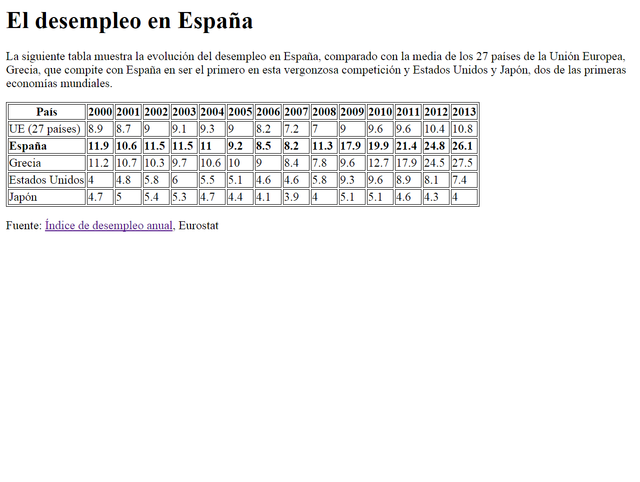
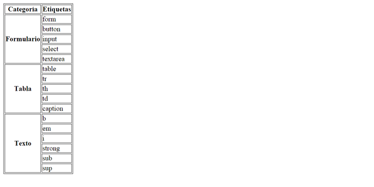
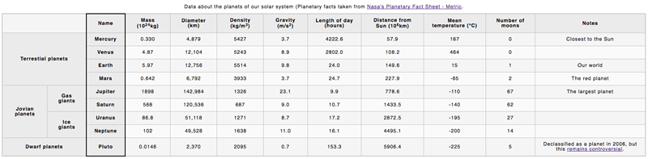
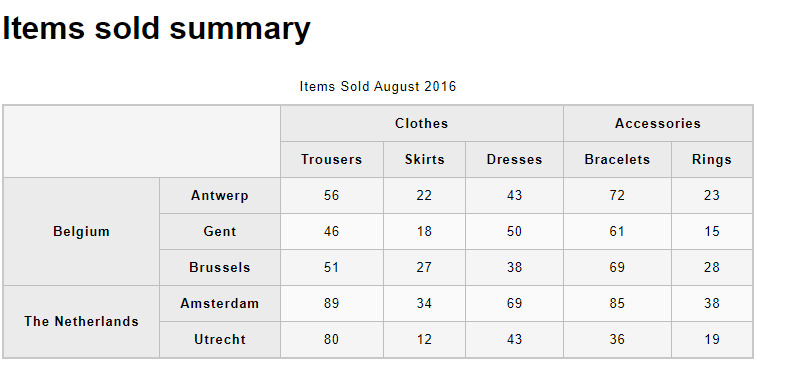

# 04. Ejercicios de Tablas

Los ejercicios se almacenarán en ficheros independientes en vuestro repositorio personal.

Cada ejercicio se guardará en un fichero con el nombre que se indica en el enunciado, dentro de una carpeta que se llamará `UT2\EC\04`.

## Ejercicio 17

Nombre fichero: 17.ejercicio.html

A partir del texto que se te proporciona, debes crear una página web que tenga el mismo aspecto que la siguiente imagen:




> **Nota**: en el código base que se te proporciona vas a encontrar una etiqueta nueva, la etiqueta "style". Esta etiqueta permite introducir instrucciones de CSS (Cascading Style Sheets) en una página web. CSS se emplea para definir la presentación visual de una página web y se explica en la segunda parte de este curso. Las instrucciones que se han incluido tienen como objetivo que la tabla y las celdas de la tabla se muestren con un borde. Esto también se podría haber logrado con el atributo border de HTML, pero es mejor utilizar siempre CSS para todo lo relacionado con la presentación de una página web.

<details>
<summary>Código base:</summary>

```text
<!DOCTYPE html>
<html>
<head>
<title>Desempleo</title>
<style>
table, tr, th, td {
  border: 1px solid black;
}
</style>
</head>
<body>

El desempleo en España


La siguiente tabla muestra la evolución del desempleo en España, comparado con la media de los 27 países de la Unión Europea, Grecia, que compite con España en ser el primero en esta vergonzosa competición y Estados Unidos y Japón, dos de las primeras economías mundiales.


País
2000
2001
2002
2003
2004
2005
2006
2007
2008
2009
2010
2011
2012
2013


UE (27 países)
8.9
8.7
9
9.1
9.3
9
8.2
7.2
7
9
9.6
9.6
10.4
10.8


España
11.9
10.6
11.5
11.5
11
9.2
8.5
8.2
11.3
17.9
19.9
21.4
24.8
26.1


Grecia
11.2
10.7
10.3
9.7
10.6
10
9
8.4
7.8
9.6
12.7
17.9
24.5
27.5


Estados Unidos
4
4.8
5.8
6
5.5
5.1
4.6
4.6
5.8
9.3
9.6
8.9
8.1
7.4


Japón
4.7
5
5.4
5.3
4.7
4.4
4.1
3.9
4
5.1
5.1
4.6
4.3
4


Fuente: Índice de desempleo anual, Eurostat

</body>
</html>
```

</details>

<hr>
<br>

## Ejercicio 18

Nombre fichero: 18.ejercicio.html

A partir del texto que se te proporciona, debes crear una página web que tenga el mismo aspecto que la siguiente imagen:



> **Nota**: en el código base que se te proporciona vas a encontrar una etiqueta nueva, la etiqueta "style".

<details>
<summary>Código base:</summary>

```html
<!DOCTYPE html>
<html>
<head>
<title>Tabla compleja</title>
<style>
table, tr, th, td {
  border: 1px solid black;
}
</style>
</head>
<body>
Categoría	Etiquetas

Formulario
form
button
input
select
textarea

Tabla
table
tr
th
td
caption

Texto
b
em
i
strong
sub
sup
</body>
</html>
```

</details>

<hr>
<br>

## Ejercicio 19


Nombre fichero: 19.ejercicio.html

- Diseña la siguiente tabla utilizando etiquetas semánticas de tablas, con un `caption, una fila header`
- Encuentrada el contenido en las correctas celdas.

**Tips**

- La primera celda de la cabecera debe ser una celda vacía, y expandir 2 columnas.

<br>



> 🔥 **Importante**<br>
> - Puedes ver este ejercicio online en [este enlace](https://mdn.github.io/learning-area/html/tables/assessment-finished/planets-data.html).
> - Los datos de la tabla están disponibles en el siguiente [enlace](https://github.com/mdn/learning-area/blob/main/html/tables/assessment-start/planets-data.txt)
> - ➕ Para más información sobre tablas y etiquetas semánticas click en este [enlace](https://lenguajehtml.com/html/tablas/etiqueta-html-table/)


<details>
<summary>Código base:</summary>

```html
<!DOCTYPE html>
<html>
<head>
<title>Tabla compleja</title>
<style>
  html {
    font-family: sans-serif;
  }

  table {
    border-collapse: collapse;
    border: 2px solid rgb(200,200,200);
    letter-spacing: 1px;
    font-size: 0.8rem;
  }

  td, th {
    border: 1px solid rgb(190,190,190);
    padding: 10px 20px;
  }

  th {
    background-color: rgb(235,235,235);
  }

  td {
    text-align: center;
  }

  tr:nth-child(even) td {
    background-color: rgb(250,250,250);
  }

  tr:nth-child(odd) td {
    background-color: rgb(245,245,245);
  }

  caption {
    padding: 10px;
  }
</style>
</head>

<body>

</body>

</html>
```

</details>


<hr>
<br>

## Ejercicio 20


Nombre fichero: 20.ejercicio.html

- Diseña la siguiente tabla utilizando etiquetas semánticas de tablas, con un `caption, una fila header`
- Encuentrada el contenido en las correctas celdas.

**Tips**

- La primera celda de la cabecera debe ser una celda vacía, y expandir 2 columnas.

<br>



> 🔥 **Importante**<br>
> - Puedes ver este ejercicio online en [este enlace](https://mdn.github.io/learning-area/html/tables/advanced/items-sold-headers.html).
> - ➕ Para más información sobre tablas y etiquetas semánticas click en este [enlace](https://lenguajehtml.com/html/tablas/etiqueta-html-table/)


<details>
<summary>Código base:</summary>

```html
<!DOCTYPE html>
<html>
<head>
<title>Tabla compleja</title>
<style>
  html {
    font-family: sans-serif;
  }

  table {
    border-collapse: collapse;
    border: 2px solid rgb(200,200,200);
    letter-spacing: 1px;
    font-size: 0.8rem;
  }

  td, th {
    border: 1px solid rgb(190,190,190);
    padding: 10px 20px;
  }

  th {
    background-color: rgb(235,235,235);
  }

  td {
    text-align: center;
  }

  tr:nth-child(even) td {
    background-color: rgb(250,250,250);
  }

  tr:nth-child(odd) td {
    background-color: rgb(245,245,245);
  }

  caption {
    padding: 10px;
  }
</style>
</head>

<body>

</body>

</html>
```

</details>


<hr>
<br>