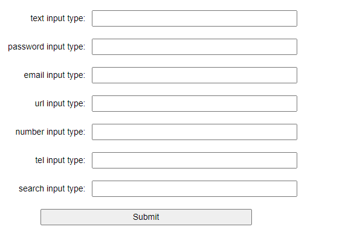
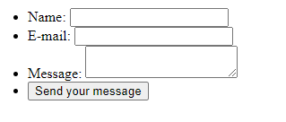
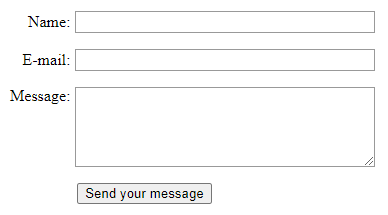
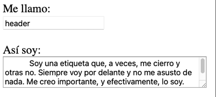
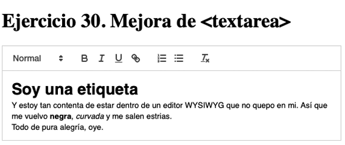
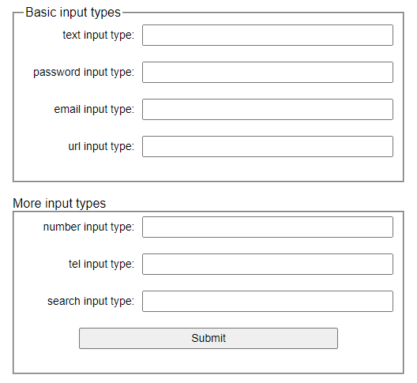
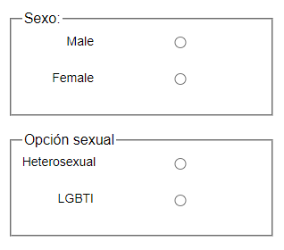

# 05. Ejercicios Formularios

Los ejercicios se almacenarán en ficheros independientes en vuestro repositorio personal.

Cada ejercicio se guardará en un fichero con el nombre que se indica en el enunciado, dentro de una carpeta que se llamará `UT2\EC\05`.

## Ejercicio 21. Diferentes tipos de campos de formulario

> 🌍 [Tutorial](https://developer.mozilla.org/es/docs/Learn/Forms/Your_first_form) para este ejercicio

Nombre fichero: 21.ejercicio.html

Crea un formulario que tenga un los campos del tipo que se indican en la siguiente imagen:




<details>
<summary>Código base:</summary>

```html
<!DOCTYPE html>
<html lang="es-ES">
<head>
    <meta charset="utf-8">
    <meta name="viewport" content="width=device-width">
    <title></title>
    <style>
      html, input {
        font-family: sans-serif;
      }

      body {
        width: 90%;
        max-width: 500px;
        margin: 0 auto;
      }

      form {
        margin-top: 20px;
      }

      div {
        margin-bottom: 20px;
        display: flex;
        justify-content: space-between;
        align-items: center;
      }

      label, input, button {
        font-size: 14px;
        line-height: 1.5
      }

      label {
        text-align: right;
        width: 30%;
        margin-right: 2%;
      }

      input {
        flex: auto;
      }

      button {
        width: 70%;
        margin: 0 auto;
      }

    </style>
 </head>
<body>

</body>
  </html>
```

</details>

<hr>
<br>

## Ejercicio 22.  Primer formulario

Nombre fichero: 22.ejercicio.html

Crea un formulario con los siguientes campos:

- Formulario con método `POST`, que envie los datos a `/my-handling-form-page`

- Etiqueta: `Name:`, Texto corto, identificador: `name`, etiqueta: `user_name`
- Etiqueta: `Email:`, Texto tipo email, identificador: `email`, etiqueta: `user_email`
- Etiqueta: `Message:`, Texto tipo largo, identificador: `message`, etiqueta: `user_message`



<hr>
<br>

## Ejercicio 23. Mejorar aspecto formulario

Nombre fichero: 23.ejercicio.html

Mejora el aspecto del formulario anterior, poniendo los campos del formulario dentro de una lista no ordenada, cada campo dentro de un elemento `li` (también el botón de envío del formulario).

**Tips**

- La primera celda de la cabecera debe ser una celda vacía, y expandir 2 columnas.

<br>




<hr>
<br>


## Ejercicio 24. Buscar en Google

Nombre fichero: 24.ejercicio.html

Crea un formulario que tenga un campo de texto y un botón de envío. El formulario debe enviar los datos a `https://www.google.com/search` con el método `GET`.

- El campo de texto debe tener el nombre `q` y el botón de envío debe tener el texto `Buscar en Google`.
- El botón de envio (type="Submit") tenga el texto `Buscar en Google`.


<hr>
<br>


## Ejercicio 25. Formulario con TextArea

Nombre fichero: 25.ejercicio.html

Crea un formulario que tenga un campo de texto y un campo de texto largo.<br>

- El campo de texto corto debe tener un tamaño de 30 caracteres y el campo de texto largo debe tener un tamaño de 10 filas y 30 columnas.<br>
- El campo de texto corto tenga un `placeholder` con el texto `mi nombre` y el campo de texto largo tenga un `placeholder` con el texto `algo sobre tí`.

- Las etiquetas de los campos de texto corto y largo deben ser `Me llamo:` y `Así soy` respectivamente, y deben estar situadas encima de los campos de texto.

- Aplica el atributo adecuado para que TextArea crezca en función del contenido.





## Ejercicio 26. Formulario con TextArea vitaminada

Nombre fichero: 26.ejercicio.html

Los campos TextArea nativos de HTML son muy básicos, tanto a nivel visual como a nivel funcional.

Para mejorar esto existen herramientas JavaScript que permiten mejorar el aspecto y funcionalidad de los campos TextArea.

Basado en el siguiente [articulo](https://lenguajehtml.com/html/formularios/etiqueta-html-textarea/#librer%C3%ADas-para-mejorar-un-textarea), y utilizando la librería [Quill](https://quilljs.com/), crea una página web que contenga un formuario con un campo de texto largo, que utilice la librería Quill para mejorar su aspecto y funcionalidad.





## Ejercicio 27. Formulario con campos numericos

Nombre fichero: 27.ejercicio.html

> 🌍 [Tipos de campos de formulario](https://developer.mozilla.org/en-US/docs/Web/HTML/Element/input/number)

Crear un formulario con 3 campos numéricos, con los siguientes requisitos:

- Campo edad: El primer campo debe tener un valor por defecto de 0, un valor mínimo de 18 y un valor máximo de 150.
- Campo Decadas: El segundo campo debe tener un valor por defecto de 1970, un valor mínimo de 1970 y un valor máximo de 2050, y se debe incrementar o decrementar de 10 en 10.
- Campo Precio: El tercer campo debe tener un valor por defecto de 0, un valor mínimo de 0 y un valor máximo de 1000, y se debe incrementar o decrementar de 0.01 en 0.01.


## Ejercicio 28. Etiquetas en los campos

Nombre fichero: 28.ejercicio.html

> 🌍 [Etiqueta label](https://developer.mozilla.org/en-US/docs/Web/HTML/Element/label)

Las etiquetas representan un texto que describe el propósito de un elemento dentro de un interfaz de usuario. Su principal uso es asociar un texto descriptivo con un campo de formulario.

Repite el ejercicio 21, pero esta vez, añade etiquetas `label` a cada campo del formulario.

Asocia cada etiqueta con su campo correspondiente mediante el atributo `for` de la etiqueta `label` y el atributo `id` del campo de formulario.


## Ejericio 29. Formulario con Fieldset y Legend

Nombre fichero: 29.ejercicio.html

Repite el ejercicio 21, pero añade 2 agrupaciones de campos con la etiqueta `fieldset` y una leyenda para cada grupo con la etiqueta `legend`.





## Ejericio 30. Formulario con selectores de opciones

Nombre fichero: 30.ejercicio.html

> 🌍 [Campo tipo radio](https://developer.mozilla.org/en-US/docs/Web/HTML/Element/input/radio)

**📝 Instrucciones:**

- Crea 2 input type=radio para elegir los valores de sexo: Masculino o Femenino.
- Crea otros 2 input type=radio para elegir las orientaciones sexuales: Heterosexual o LGTBI.

*Comprobar*

- Solo se debe permitir elegir una opción de cada grupo.

<br>

