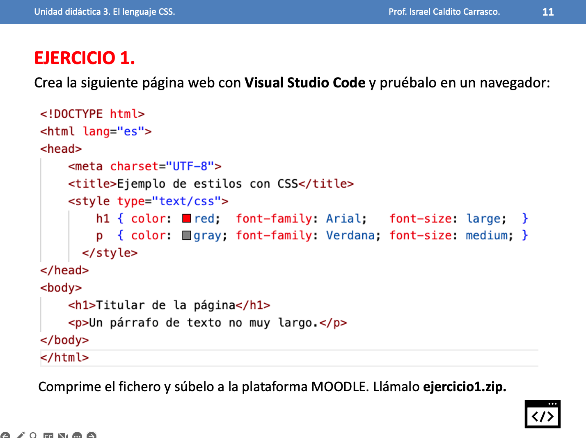
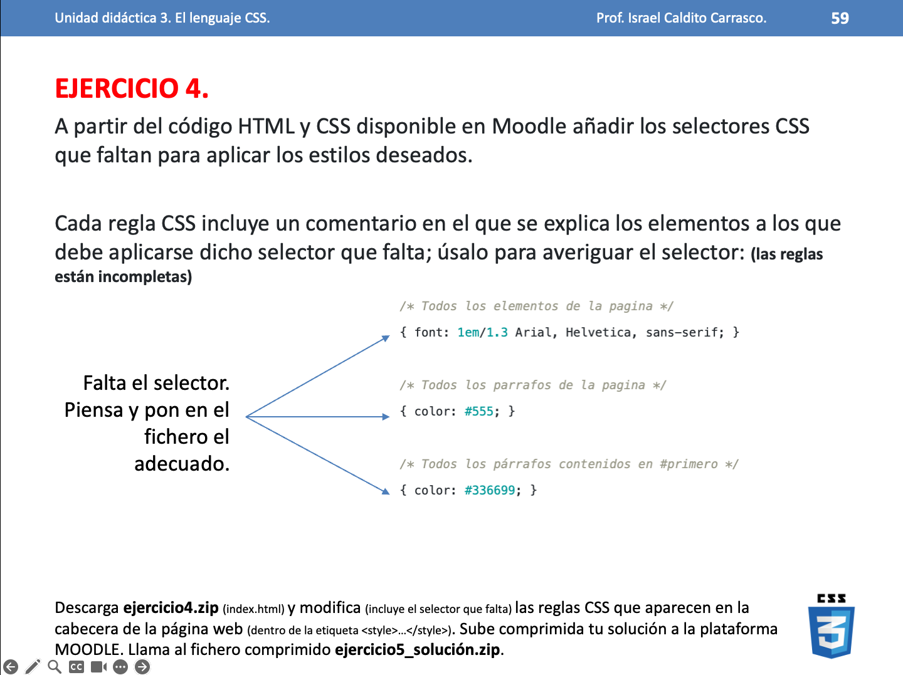
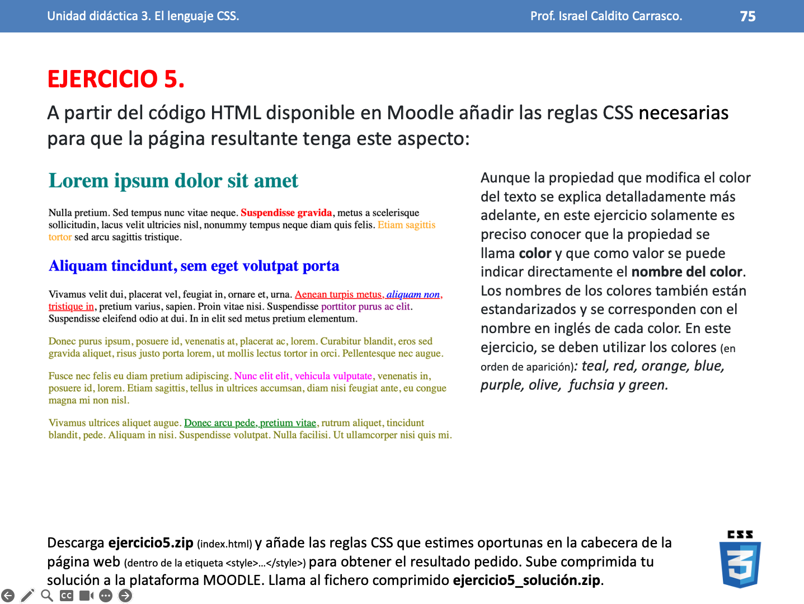
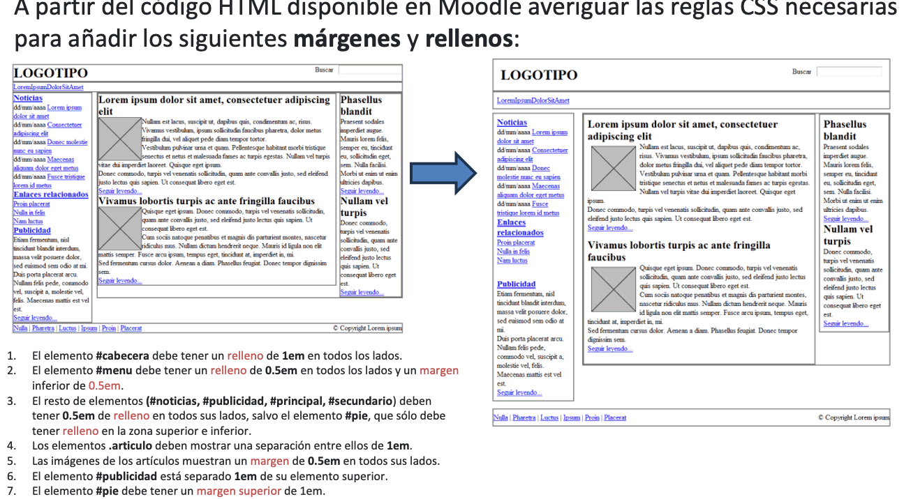
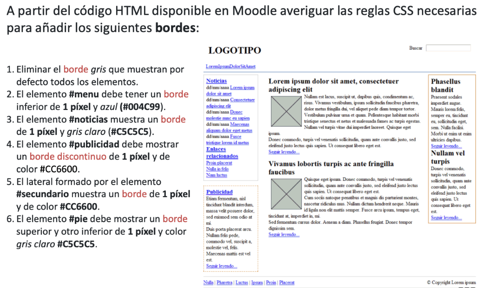
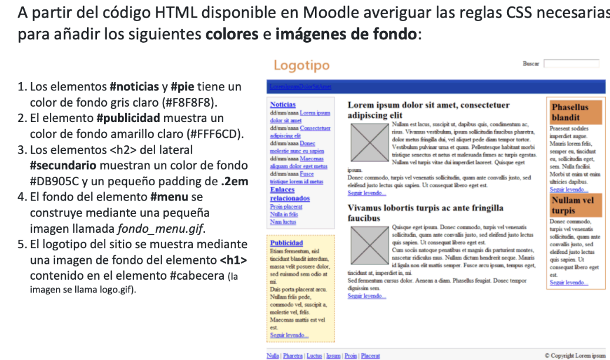
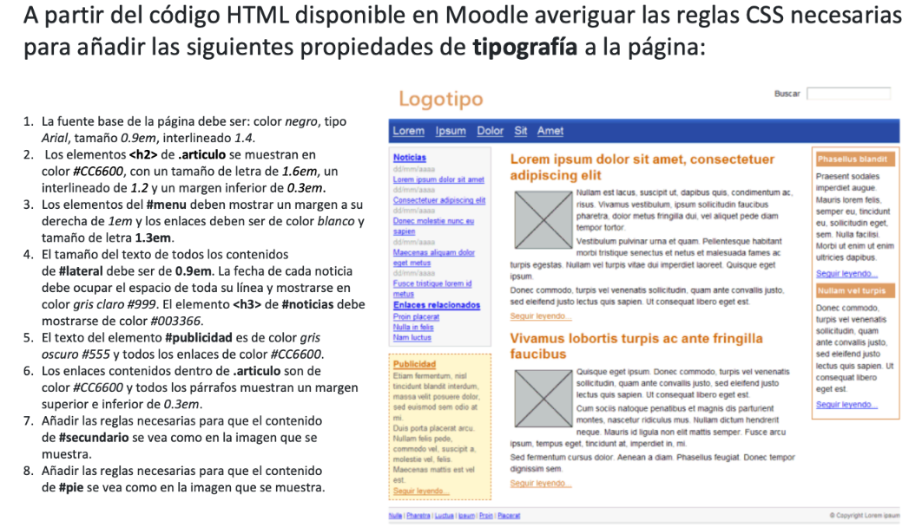

# 01. Ejercicios CSS

Los ejercicios se almacenarán en ficheros independientes en vuestro repositorio personal.

Cada ejercicio se guardará en un fichero con el nombre que se indica en el enunciado, dentro de una carpeta que se llamará `UT3\EC\01-Basicos`.

### Ejercicio 1

Ubicación: `UT3\EC\01-Basicos\01\01.ejercicio.html`
Nombre fichero: 01.ejercicio.html

Crea la siguiente página web con VSCode y pruébala en un navegador.




### Ejercicio 2

Ubcación: `UT3\EC\01-Basicos\02\02.ejercicio.html`
Nombre fichero: 02.ejercicio.html

En base al ejercicio anterior, exterioriza el estilo CSS en un fichero externo llamado `estilos.css` y vincúlalo a la página web. Borra el estilo interno de la página web.


### Ejercicio 4

Ubcación: `UT3\EC\01-Basicos\04\04.ejercicio.html`
Nombre fichero: 04.ejercicio.html



En base al siguiente código HTML, aplica utilizando las etiquetas `style` las reglas utilizando los selectores adecuados según se indica en la imagen.


```html
<!DOCTYPE html>
<html lang="es">
<head>
    <meta charset="UTF-8">
    <title>Ejercico 4</title>
    <style type="text/css">
        /* Todos los elementos de la pagina */
        { font: 1em/1.3 Arial, Helvetica, sans-serif; }
        
        /* Todos los parrafos de la pagina */
        { color: #555; }
        
        /* Todos los párrafos contenidos en #primero */
        { color: #336699; }
        
        /* Todos los enlaces la pagina */
        { color: #CC3300; }
        
        /* Los elementos "em" contenidos en #primero */
        { background: #FFFFCC; padding: .1em; }
        
        /* Todos los elementos "em" de clase "especial" en toda la pagina */
        { background: #FFCC99; border: 1px solid #FF9900; padding: .1em; }
        
        /* Elementos "span" contenidos en .normal */
        { font-weight: bold; }
    </style>
</head>
<body>
    <div id="primero">
        <p>Lorem ipsum dolor sit amet, <a href="#">consectetuer adipiscing elit</a>. Praesent blandit nibh at felis. Sed nec diam in dolor vestibulum aliquet. Duis ullamcorper, nisi non facilisis molestie, <em>lorem sem aliquam nulla</em>, id lacinia velit mi vestibulum enim.
        </p>
    </div>
        
    <div class="normal">
        <p>Phasellus eu velit sed lorem sodales egestas. Ut feugiat. <span><a href="#">Donec porttitor</a>, magna eu varius luctus,</span> metus massa tristique massa, in imperdiet est velit vel magna. Phasellus erat. Duis risus. <a href="#">Maecenas dictum</a>, nibh vitae pellentesque auctor, tellus velit consectetuer tellus, tempor pretium felis tellus at metus.</p>
        
        <p>Cum sociis natoque <em class="especial">penatibus et magnis</em> dis parturient montes, nascetur ridiculus mus. Proin aliquam convallis ante. Pellentesque habitant morbi tristique senectus et netus et malesuada fames ac turpis egestas. Nunc aliquet. Sed eu metus. Duis justo.</p>
        
        <p>Donec facilisis blandit velit. Vestibulum nisi. Proin volutpat, <em class="especial">enim id iaculis congue</em>, orci justo ultrices tortor, <a href="#">quis lacinia eros libero in eros</a>. Sed malesuada dui vel quam. Integer at eros.</p>
    </div>

    </body>
    </html>
```


### Ejercicio 5

Ubicación: `UT3\EC\01-Basicos\05\05.ejercicio.html`
Nombre fichero: 05.ejercicio.html



En base al siguiente código HTML, aplica utilizando las etiquetas `style` las reglas según los selectores adecuados según el html dado.

```html	

<!DOCTYPE html>
<html lang="es">
<head>
    <meta charset="UTF-8">
    <title>Ejercico 5</title>
    <style type="text/css">
        /* Escribe aquí las reglas CSS */
        
    </style>
</head>
<body>
    <h1 id="titulo">Lorem ipsum dolor sit amet</h1>
    
    <p>Nulla pretium. Sed tempus nunc vitae neque. <strong>Suspendisse gravida</strong>, metus a scelerisque sollicitudin, lacus velit
    ultricies nisl, nonummy tempus neque diam quis felis. <span class="destacado">Etiam sagittis tortor</span> sed arcu sagittis tristique.</p>
    
    <h2 id="subtitulo">Aliquam tincidunt, sem eget volutpat porta</h2>
    
    <p>Vivamus velit dui, placerat vel, feugiat in, ornare et, urna.  <a href="#">Aenean turpis metus, <em>aliquam non</em>, tristique in</a>, pretium varius, sapien. Proin vitae nisi.  Suspendisse <span class="especial">porttitor purus ac elit</span>. Suspendisse eleifend odio at dui. In in elit sed metus pretium elementum.</p>

    <div id="adicional">
    <p>Donec purus ipsum, posuere id, venenatis at, <span>placerat ac, lorem</span>. Curabitur blandit, eros sed gravida aliquet, risus justo
    porta lorem, ut mollis lectus tortor in orci. Pellentesque nec augue.</p>
    
    <p>Fusce nec felis eu diam pretium adipiscing. <span id="especial">Nunc elit elit, vehicula vulputate</span>, venenatis in,
    posuere id, lorem. Etiam sagittis, tellus in ultrices accumsan, diam nisi feugiat ante, eu congue magna mi non nisl.</p>
    
    <p>Vivamus ultrices aliquet augue. <a href="#">Donec arcu pede, pretium vitae</a>, rutrum aliquet, tincidunt blandit, pede.
    Aliquam in nisi. Suspendisse volutpat. Nulla facilisi. Ut ullamcorper nisi quis mi.</p>
    </div>
</body>
</html>
```


### Ejercicio 6. Trabajo con márggenes y rellenos

Ubicación: `UT3\EC\01-Basicos\06\06.ejercicio.html`
Nombre fichero: 06.ejercicio.html



En base a los recursos del ejercicio [06](./01/01.6/index.html) y según se visualiza en la imagen, modifica las reglas CSS dentro del fichero `css\estilos.css` para aplicar las siguiente modificaciones:

1. El elemento #cabecera debe tener un relleno de 1em en todos los lados.
2. El elemento #menu debe tener un relleno de 0.5em en todos los lados y un margen inferior de 0.5em.
3. El resto de elementos (#noticias, #publicidad, #principal, #secundario) deben tener 0.5em de relleno en todos sus lados, salvo el elemento #pie, que sólo debe tener relleno en la zona superior e inferior.
4. Los elementos .articulo deben mostrar una separación entre ellos de 1em.
5. Las imágenes de los artículos muestran un margen de 0.5em en todos sus lados.
6. El elemento #publicidad está separado 1em de su elemento superior.
7. El elemento #pie debe tener un margen superior de 1em.


### Ejercicio 7. Trabajo con bordes

Ubicación: `UT3\EC\01-Basicos\07\07.ejercicio.html`
Nombre fichero: 07.ejercicio.html



En base a los recursos del ejercicio [07](./01/01.7/index.html) y según se visualiza en la imagen, modifica las reglas CSS dentro del fichero `css\estilos.css` para aplicar las siguiente modificaciones:


1. Eliminar el borde gris que muestran por defecto todos los elementos.
2. El elemento #menu debe tener un borde inferior de 1 píxel y azul (#004C99).
3. El elemento #noticias muestra un borde de 1 píxel y gris claro (#C5C5C5).
4. El elemento #publicidad debe mostrar un borde discontinuo de 1 píxel y de color #CC6600.
5. El lateral formado por el elemento #secundario muestra un borde de 1 píxel y de color #CC6600.
6. El elemento #pie debe mostrar un borde superior y otro inferior de 1 píxel y color gris claro #C5C5C5.


### Ejercicio 8. Imágenes y colores de fondo

Ubicación: `UT3\EC\01-Basicos\08\08.ejercicio.html`
Nombre fichero: 07.ejercicio.html



En base a los recursos del ejercicio [08](./01/01.7/index.html) y según se visualiza en la imagen, modifica las reglas CSS dentro del fichero `css\estilos.css` para aplicar las siguiente modificaciones:

1. Los elementos #noticias y #pie tiene un color de fondo gris claro (#F8F8F8).
2. El elemento #publicidad muestra un color de fondo amarillo claro (#FFF6CD).
3. Los elementos `<h2`> del lateral #secundario muestran un color de fondo #DB905C y un pequeño padding de .2em.
4. El fondo del elemento #menu se construye mediante una pequeña imagen llamada fondo_menu.gif.
5. El logotipo del sitio se muestra mediante una imagen de fondo del elemento `<h1>` contenido en el elemento #cabecera (la imagen se llama logo.gif).


### Ejercicio 10. Estableciendo una tipografía

Ubicación: `UT3\EC\01-Basicos\10\10.ejercicio.html`
Nombre fichero: 07.ejercicio.html



En base a los recursos del ejercicio [10](./01/01.10/index.html) y según se visualiza en la imagen, modifica las reglas CSS dentro del fichero `css\estilos.css` para aplicar las siguiente modificaciones:

1. La fuente base de la página debe ser: color negro, tipo Arial, tamaño 0.9em, interlineado 1.4.

2. Los elementos `<h2>` de .articulo se muestran en color #CC6600, con un tamaño de letra de 1.6em, un interlineado de 1.2 y un margen inferior de 0.3em.

3. Los elementos del #menu deben mostrar un margen a su derecha de 1em y los enlaces deben ser de color blanco y tamaño de letra 1.3em.

4. El tamaño del texto de todos los contenidos de #lateral debe ser de 0.9em. La fecha de cada noticia debe ocupar el espacio de toda su línea y mostrarse en color gris claro #999. El elemento `<h3>` de #noticias debe mostrarse de color #003366.

5. El texto del elemento #publicidad es de color gris oscuro #555 y todos los enlaces de color #CC6600.

6. Los enlaces contenidos dentro de .articulo son de color #CC6600 y todos los párrafos muestran un margen superior e inferior de 0.3em.

7. Añadir las reglas necesarias para que el contenido de #secundario se vea como en la imagen que se muestra.

8. Añadir las reglas necesarias para que el contenido de #pie se vea como en la imagen que se muestra.

