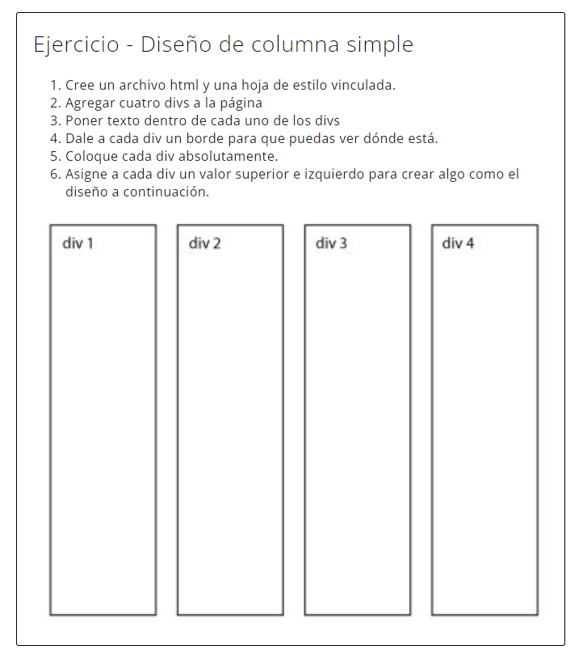
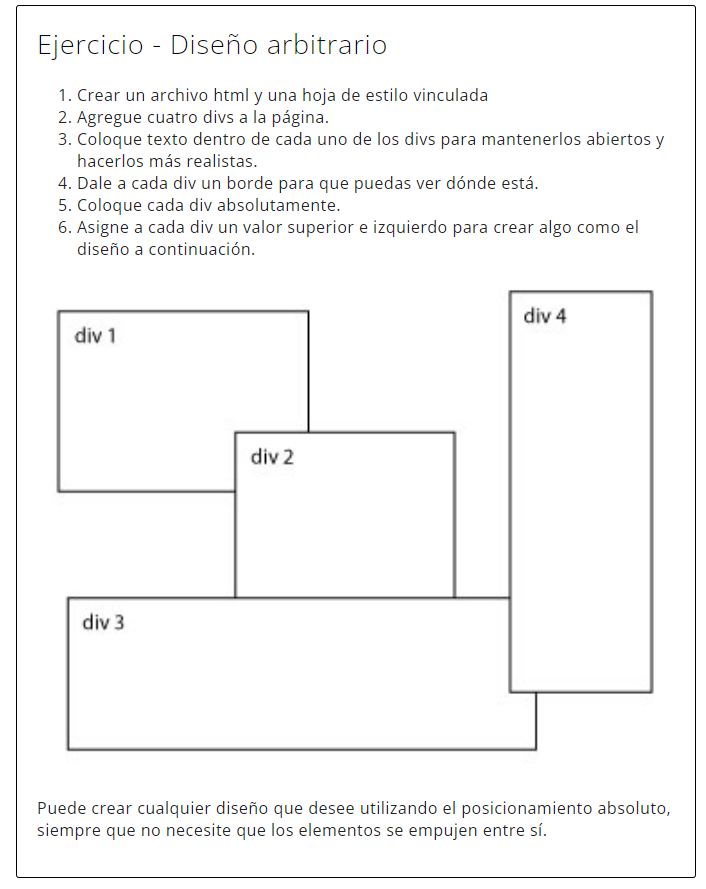

# 09. EJERCICIOS CSS POSITION

En esta serie de ejercicios se trabaja con la propiedad `position` de CSS. Se trata de una propiedad que permite controlar la posición de los elementos en la página, de forma absoluta o relativa al contenedor padre.

> Guardar este ejercicio en vuestro repositorio personal, en la carpeta que se llamará `UT3\EC\09`.


### 💢 **Propiedad: Position**

<br>

## Ejercicio 1: Diseño de columna simple
<br>

Crear un único fichero "01.index.html", y sigue las instrucciones dentro de la imagen adjunta.

**Normas de realización**:

Hay que utilizar la propiedad `position`, no se puede realizar con la propiedad `display.`

> Solo crear el cuadro externo y los div internos. El texto no se debe incluir en el resultado.




<br>

## Ejercicio 2: Diseño arbitario

Crear un único fichero "02.index.html", y sigue las instrucciones dentro de la imagen adjunta.

**Normas de realización**:

Hay que utilizar la propiedad `position`, no se puede realizar con la propiedad `display.`

> Solo crear el cuadro externo y los div internos. El texto no se debe incluir en el resultado.



<br><br>

## Ejercicio 03: Diseño Sticky

Crear un único fichero "03.index.html", y sigue las instrucciones dentro de la imagen adjunta.

En base al código HTML y CSS de base suministrado conseguir el resultado que se muestra en la imagen.<br>


HTML base
```html
<!DOCTYPE html>
<html>
<head>
<meta charset="utf-8" />
<title>HTML y CSS: Curso avanzado</title>
</head>
<body>
<main class="main-container">
  <header class="main-header">HEADER</header>
  <div class="main-content">MAIN CONTENT</div>
  <footer class="main-footer">FOOTER</footer>
</main>
</body>
</html>
```

CSS
```css
body{
    color:#fff;
    font-family:arial;
    font-weight:bold;
    font-size:40px; 
}

.main-container{ 
    max-width:600px; 
    margin:0 auto; 
    border:solid 10px green; 
    padding:10px; 
    margin-top:40px;
}

.main-container * {
    padding:10px;
    background:#aaa; 
    border:dashed 5px #000;
}

.main-container * + *{
    margin-top:20px;
}

.main-header{
  height:50px; 
  background:#aaa;
  border-color:red;
}

.main-content{
  min-height:1000px;
}

.main-header {
    /* INCLUYE LAS PROPIEDADES NECESARIAS*/
}
```

