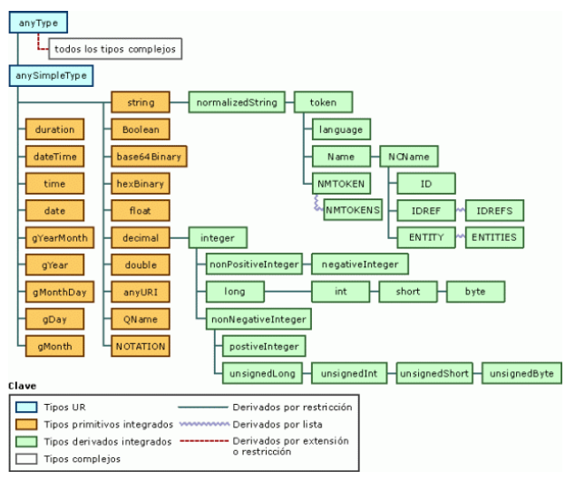

# ESQUEMAS XSD

## 1. Introducción

Los esquemas XSD son un tipo de documento XML que sirve para definir la estructura de otros documentos XML. Los esquemas XSD se utilizan para validar la estructura de los documentos XML, es decir, para comprobar que los documentos XML cumplen con la estructura definida en el esquema XSD.

Es una alternativa a los DTD (Document Type Definition) que se utilizaban en XML. Los esquemas XSD son más potentes que los DTD y permiten definir estructuras más complejas que los DTD.

Las características más importantes de los esquemas XSD son las siguientes:	

- Se definen utilizando XML.
- Se utilizan para definir la estructura de los documentos XML.
- Se utilizan para validar la estructura de los documentos XML.
- Son más potentes que los DTD.
- Permiten definir estructuras más complejas que los DTD.
- Permiten definir tipos de datos complejos.
- Permiten definir restricciones sobre los tipos de datos.
- Permiten definir espacios de nombres.
- Permiten definir elementos XML que pueden aparecer en cualquier orden.
- Permite especificar de forma más precisa la cardinalidad de los elementos XML.

## 2. Definiciónn de XSD. XML Esquema

Ejemplo de schema XSD que identifica la estructura de un libro (libro.xsd)

```xml 
<?xml version="1.0" encoding="UTF-8"?>
<xs:schema xmlns:xs="http://www.w3.org/2001/XMLSchema">
...  
</xs:element>
```
- 'xs:schema' es el elemento raíz de un esquema XSD.
- `xs:schema xmlns:xs="http://www.w3.org/2001/XMLSchema"`: indica que el documento es un esquema XSD.
- El prefijo `xs` se utiliza para indicar que los elementos XML que se utilizan en el esquema XSD pertenecen al espacio de nombres `http://www.w3.org/2001/XMLSchema`.
- Cada vez que se utilice un elemento XML que pertenezca al espacio de nombres `http://www.w3.org/2001/XMLSchema` se debe utilizar el prefijo `xs`.

Un ejemplo de esquema completo sería el siguiente

```xml
<?xml version="1.0" encoding="UTF-8"?>
<xs:schema xmlns:xs="http://www.w3.org/2001/XMLSchema">
  <xs:element name="libro">
    <xs:complexType>
      <xs:sequence>
        <xs:element name="titulo" type="xs:string"/>
        <xs:element name="autor" type="xs:string"/>
        <xs:element name="editorial" type="xs:string"/>
        <xs:element name="precio" type="xs:decimal"/>
      </xs:sequence>
    </xs:complexType>
  </xs:element>
</xs:schema>
```

El xml que valida este esquema sería el siguiente

```xml
<?xml version="1.0" encoding="UTF-8"?>
<libro xmlns:xs="http://www.w3.org/2001/XMLSchema-instance">
  <titulo autor="Miguel de Cervantes">El Quijote</titulo>
  <autor>Miguel de Cervantes</autor>
  <editorial>Planeta</editorial>
  <precio>19.95</precio>
</libro>
```

Como se puede observar, el elemento libro es un elemento `compuesto` que contiene otros elementos `simples` como titulo, autor, editorial y precio.

> 💡 En DTD el tipo #PCDATA es el equivalente al tipo `xs:string` de XSD. En DTD no se utilizaban prácticamente los tipos de datos.<br>
> ↘️ En XSD se utilizan los tipos de datos para definir los elementos XML.


## 3. Elementos de un esquema XSD

Un esquema XSD es un documento XML que contiene una serie de elementos que definen la estructura de los documentos XML que se van a validar con ese esquema XSD. Los elementos más importantes de un esquema XSD son los siguientes:

- **xs:schema**: es el elemento raíz de un esquema XSD. Este elemento tiene un atributo llamado *targetNamespace* que se utiliza para indicar el espacio de nombres al que pertenecen los elementos definidos en el esquema XSD. El espacio de nombres de un esquema XSD se suele definir como una URL que apunta a la ubicación del esquema XSD. Por ejemplo, el espacio de nombres del esquema XSD que define la estructura de los documentos XML de la factura electrónica es el siguiente: http://www.facturae.es/Facturae/2009/v3.2/Facturae
  
```xml
<xs:schema xmlns:xs="http://www.w3.org/2001/XMLSchema" targetNamespace="http://www.facturae.es/Facturae/2009/v3.2/Facturae">
```

### 3.1 Componentes básicos de un esquema XSD	

Los componentes básicos de un esquema XSD son los siguientes:

- **xs:element**: se utiliza para definir los elementos XML que se pueden utilizar en los documentos XML que se van a validar con el esquema XSD.
- **xs:attribute**: se utiliza para definir los atributos XML que se pueden utilizar en los documentos XML que se van a validar con el esquema XSD.


### 3.2 Elementos de un esquema XSD

  #### 3.2.1 Element

  Un elemento se corresponde con una etiqueta XML. Un elemento puede ser simple o complejo.

  - Un elemento simple es un elemento que no contiene otros elementos XML. Por ejemplo, el elemento *titulo* del esquema XSD del libro es un elemento simple.
  - Un elemento complejo es un elemento que contiene otros elementos XML. Por ejemplo, el elemento *libro* del esquema XSD del libro es un elemento complejo.
  - Un elemento puede tener atributos. Por ejemplo, el elemento *libro* del esquema XSD del libro tiene un atributo llamado *autor*.
  - Un elemento tiene un tipo de datos. Por ejemplo, el elemento *titulo* del esquema XSD del libro tiene un tipo de datos *xs:string*.

  **Valores por defect**

  Un elemento puede tener un valor por defecto. Por ejemplo, el elemento *libro* del esquema XSD del libro tiene un atributo llamado *autor* con un valor por defecto *Miguel de Cervantes*.

  ```xsd
  <xsd:element name="libro">
    <xsd:complexType>
      <xsd:sequence>
        <xsd:element name="titulo" type="xsd:string"/>
        <xsd:element name="autor" type="xsd:string" default="Miguel de Cervantes"/>
        <xsd:element name="editorial" type="xsd:string"/>
        <xsd:element name="precio" type="xsd:decimal"/>
      </xsd:sequence>
    </xsd:complexType>
  </xsd:element>
  ```

  De esta forma, si el elemento *autor* no aparece en el documento XML, se le asigna el valor por defecto *Miguel de Cervantes*.

  **Valores fijos**

  Un elemento puede tener un valor fijo. Por ejemplo, el elemento *libro* del esquema XSD del libro tiene un atributo llamado *autor* con un valor fijo *Miguel de Cervantes*.

  ```xsd
  <xsd:element name="libro">
    <xsd:complexType>
      <xsd:sequence>
        <xsd:element name="titulo" type="xsd:string"/>
        <xsd:element name="autor" type="xsd:string" fixed="Miguel de Cervantes"/>
        <xsd:element name="editorial" type="xsd:string"/>
        <xsd:element name="precio" type="xsd:decimal"/>
      </xsd:sequence>
    </xsd:complexType>
  </xsd:element>
  ```
  De esta forma, si el elemento *autor* aparece en el documento XML, debe tener el valor *Miguel de Cervantes*.


  ##### Atributos de un xs:element

  Los atributos de un *xs:element* son los siguientes:

  - **name**: se utiliza para indicar el nombre del elemento XML que se está definiendo.
  - **type**: se utiliza para indicar el tipo de datos del elemento XML que se está definiendo.
  - **minOccurs**: se utiliza para indicar el número mínimo de veces que puede aparecer el elemento XML que se está definiendo.
  - **maxOccurs**: se utiliza para indicar el número máximo de veces que puede aparecer el elemento XML que se está definiendo.
  - **ref**: se utiliza para indicar que el elemento XML que se está definiendo es una referencia a otro elemento XML que se ha definido previamente en el esquema XSD.
  - **base**: se utiliza para indicar el tipo de datos del elemento XML que se está definiendo.
  - **default**: se utiliza para indicar el valor por defecto del elemento XML que se está definiendo.
  - **fixed**: se utiliza para indicar el valor fijo del elemento XML que se está definiendo.
  - **use**: se utiliza para indicar si el atributo XML que se está definiendo es obligatorio o no. Los valores que puede tomar este atributo son los siguientes:
    - **required**: indica que el atributo XML que se está definiendo es obligatorio.
    - **optional**: indica que el atributo XML que se está definiendo es opcional.
    - **prohibited**: indica que el atributo XML que se está definiendo no se puede utilizar.


  > 💡 **Importante**
    - Los atributos pueden aparecer en cualquier orden, pero los elementos deben aparecer en el orden en que se definen.<br>
    - Los atributos pueden tener restricciones, esto se explica en el siguiente apartado.<br>


  #### 3.2.2 Elementos complejos

  Un elemento complejo es un elemento que contiene otros elementos XML. Un elemento complejo se define utilizando el elemento *xs:complexType*.

  Un elemento complejo puede tener los siguientes elementos hijos:

  - **xs:sequence**: se utiliza este elemento para indicar una secuencia de elementos que tienen que aparecer en el documento XML. Deben aparecer todos, y en el mismo orden en que se especifican.

  ```xml
  <xsd:element name="camiseta">
    <xsd:complexType>
      <xsd:sequence>
        <xsd:element name="color" type="xsd:string"/>
        <xsd:element name="talla" type="xsd:string"/>
      <xsd:sequence>
    </xsd:complexType>
  </xsd:element>
  ```

  - **xs:choice**: especifica una lista de elementos de los cuales sólo puede aparecer uno en el documento XML.

    ```xml
    <xsd:element name="camiseta">
      <xsd:complexType>
        <xsd:choice>
          <xsd:element name="color" type="xsd:string"/>
          <xsd:element name="talla" type="xsd:string"/>
        <xsd:choice>
      </xsd:complexType>
    </xsd:element>
    ```
    Un XML que valida este esquema sería el siguiente

    ```xml
    <camiseta>
      <color>rojo</color>
    </camiseta>
    ```
    o este otro

    ```xml
    <camiseta>
      <talla>XL</talla>
    </camiseta>
    ```

    En un xs:choice solo puede aparecer centro del elemento uno de los elementos que forman parte del xs:choice.

  - **xs:all**: se comporta igual que el elemento <xsd:sequence>, pero no es obligado que en el documento XML aparezcan todos los elementos especificados, ni en el mismo orden

    ```xml
    <xsd:element name="camiseta">
      <xsd:complexType>
        <xsd:all>
          <xsd:element name="color" type="xsd:string"/>
          <xsd:element name="talla" type="xsd:string"/>
        <xsd:all>
      </xsd:complexType>
    </xsd:element>
    ```
    Un XML que valida este esquema sería el siguiente

    ```xml
    <camiseta>
      <color>rojo</color>
      <talla>XL</talla>
    </camiseta>
    ```
    y también este otro

    ```xml
    <camiseta>
      <talla>XL</talla>
      <color>rojo</color>
    </camiseta>
    ```

    o este otro:
    
    ```xml
    <camiseta>
      <color>rojo</color>
    </camiseta>
    ```


### 3.3 Modelo de contenido para elementos

El contenido de un elemento se define mediante un modelo de contenido. En XML Schema existen cuatro modelos de contenido para elementos:

1. Valor simple: el elemento XML sólo puede contener un valor simple. Por ejemplo, el elemento *titulo* del esquema XSD del libro tiene un modelo de contenido de valor simple.
1. Vacio: el elemento XML no puede contener ningún valor.
2. Lista: el elemento XML puede contener una lista de valores simples.
3. Mixto: el elemento XML puede contener un valor simple y otros elementos XML.

#### 3.3.1 Valor simple

Un elemento de valor simple solo contiene un valor de un tipo determinado especificado.

```xml
<xs:element name="titulo" type="xs:string"/>
```
o también

```xml
<xs:element name="edad" type="xs:int"/>
```

#### 3.3.2 Vacio

Un elemento vacío no contiene ningún valor. 

> 💡 En XML Schema se utiliza el elemento *xs:empty* para indicar que un elemento XML es vacío.

  ```xml
  <xs:element name="sin_clasificacion" type="xs:empty"/>
  ```
> ↘️ Pero eso no implica que el elemento no pueda tener atributos.

Más adelante se ampliará este concepto de elementos vacios, pues cuando se utilizan atributos es más complejo de definir.


#### 3.3.3 Lista

Un elemento puede contener centro otros sub-elementos. Existen 3 formas de indicar esto:

- **xs:sequence**
- **xs:choice**
- **xs:all**


#### 3.3.4 Mixto

Un elemento mixto es un elemento que puede contener un valor simple y otros elementos XML. Los elementos hijo se definen igual que en el modelo anterior, mediante los elementos “sequence”, “choice” o “all”. Para indicar que el elemento puede además incluir datos carácter se usa el atributo “mixed” con valor igual al “true” en el elemento “complexType”. Ejemplo:

```xml
<xsd:element name="confirmacionPedido">
  <xsd:complexType mixed=”true”>
    <xsd:sequence>
      <xsd:element name=”intro” type=”xsd:string”/>
      <xsd:element name=”nombre” type=”xsd:string”/>
      <xsd:element name=”fecha” type=”xsd:string”/>
      <xsd:element name=”titulo” type=”xsd:string”/>
    <xsd:sequence>
  </xsd:complexType>
</xsd:element>
```
El elemento definido arriba podría usarse dentro de un documento XML de la siguiente manera:

```xml
<confimacionPedido>
  <intro>Para:</intro>
  <nombre>Antonio Lara</nombre>
  Confirmamos que con fecha <fecha>24-01-2005</fecha> hemos recibido su pedido de <titulo>Raices</titulo>. Su título será enviado en 2 días hábiles desde la recepción del pedido. Gracias,Ediciones Aranda.
</confimacionPedido>
```


### 3.4 Tipos de datos

Son 44 los tipos de datos que define el estándar XML Schema, clasificados de una manera jerárquica, en el que los elementos hijos poseen las mismas características del padre más alguna particularidad añadida que los distinga.

El tipos de datos predefinido principal es `xs:anyType`, el más genérico y del cual derivan el resto de tipos de datos predefinidos como podemos ver en la siguiente imagen.




## 4. Atributos de un esquema XSD

**¿ Cómo se define un atributo en un esquema XSD ?**

La sintaxis genérica de declaración de atributos es la siguiente:

```xml
<xsd:attribute name="nombreAtributo" type="tipoSimple" use="valor" default="valor" fixed="valor"/>
```
- **name**: es el nombre del atributo.
- **type**: el tipo del atributo. Los atributos sólo pueden contener tipos simples.
- **use** (Opcional): puede tomar uno de los siguientes valores:
  - required: el atributo debe aparecer en el documento XML.
  - optional: el atributo puede aparecer o no aparecer en el documento XML. Este es el valor por defecto.
  - prohibited: el atributo no debe aparecer en el documento XML.
  
- **default** (Opcional): si el atributo no aparece en el documento XML, se le asigna el valor especificado en el atributo “default”. Los valores por defecto sólo tienen sentido si el atributo es opcional, de lo contrario tendremos un error.
- **fixed** (Opcional): define un valor fijo para el atributo. 
  - Si el valor del atributo está presente en la instancia del documento XML, el valor debe ser el mismo que el que indica el atributo “fixed”
  - si el atributo no está presente en el documento XML, se le asigna el valor contenido en el atributo “fixed”

> 💡 Los valores de los atributos “default” y “fixed” son mutuamente exclusivos, por lo tanto habrá un error si una declaración contiene ambos.<br>
> ↘️ Si no se especifica el atributo “use”, el valor por defecto es “optional”.<br>
> 🌩️ Solo los elementos de tipo compuesto pueden tener atributos.<br>

Las declaraciones de atributos para un elemento deben aparecer siempre al final de la declaración del elemento. Ejemplo:

```xml
<xsd:element name="libro">
  <xsd:complexType>
    <xsd:sequence>
      <xsd:element name="titulo" type="xsd:string"/>
      <xsd:element name="autor" type="xsd:string"/>
    </xsd:sequence>
    <xsd:attribute name="isbn" type="xsd:string"/>
  </xsd:complexType>
</xsd:element>
```
El elemento complejo libro tiene dos elementos hijos (titulo y autor) y un atributo (isbn). El atributo isbn es opcional, ya que no tiene el atributo “use” y por lo tanto el valor por defecto es “optional”.

### 4.1 Atributos de tipo simple 

Los atributos de tipo simple son aquellos que sólo pueden contener un valor simple. Los atributos de tipo simple se definen utilizando el elemento *xs:attribute*.

```xml
<xsd:attribute name="isbn" type="xsd:string"/>
```

### 4.2 Atributos con restricciones

Los atributos pueden tener restricciones. Las restricciones que se pueden aplicar a los atributos son las siguientes:

- **xs:enumeration**: se utiliza para indicar una lista de valores que puede tomar el atributo.
- **xs:pattern**: se utiliza para indicar una expresión regular que debe cumplir el atributo.
- **xs:maxInclusive/maxExclusive**: se utiliza para indicar el valor máximo (incluido o no) que puede tomar el atributo.
- **xs:minInclusive/Exclusive**: se utiliza para indicar el valor mínimo (incluido o no) que puede tomar el atributo.

Ejemplo de atributo con restricciones:

```xml
<xsd:attribute name="isbn">
  <xsd:simpleType>
    <xsd:restriction base="xsd:string">
      <xsd:pattern value="[0-9]{3}-[0-9]{2}-[0-9]{4}-[0-9]{4}-[0-9]{1}"/>
    </xsd:restriction>
  </xsd:simpleType>
</xsd:attribute>
```

El atributo isbn debe tener un valor que cumpla la expresión regular indicada en el elemento *xs:pattern*.

> ▶️ **Importante**
> - Cuando un atributo tiene restricciones, no puede tener un tipo de datos asociado.<br>
>   Requiere que el atributo “type” no esté presente.<br>
>   En la `xs:restriction` se indica el tipo de datos del atributo.<br>

En el siguiente ejemplo se usa un atrbuto con una enumeración de valores posibles:

```xml
<xsd:attribute name="tipo">
  <xsd:simpleType>
    <xsd:restriction base="xsd:string">
      <xsd:enumeration value="novela"/>
      <xsd:enumeration value="ensayo"/>
      <xsd:enumeration value="poesia"/>
    </xsd:restriction>
  </xsd:simpleType>
</xsd:attribute>
```

El xml que valida este esquema sería el siguiente

```xml
<libro tipo="novela">
  <titulo>El Quijote</titulo>
  <autor>Miguel de Cervantes</autor>
  <editorial>Planeta</editorial>
  <precio>19.95</precio>
</libro>
```

### 4.3 Atributos de tipo compuesto

Los atributos de tipo compuesto son aquellos que pueden contener otros elementos XML. Los atributos de tipo compuesto se definen utilizando el elemento *xs:attributeGroup*.

```xml
<xsd:attributeGroup name="atributosLibro">
  <xsd:attribute name="isbn" type="xsd:string"/>
  <xsd:attribute name="tipo">
    <xsd:simpleType>
      <xsd:restriction base="xsd:string">
        <xsd:enumeration value="novela"/>
        <xsd:enumeration value="ensayo"/>
        <xsd:enumeration value="poesia"/>
      </xsd:restriction>
    </xsd:simpleType>
  </xsd:attribute>
</xsd:attributeGroup>
```

El atributoGroup “atributosLibro” se puede utilizar en cualquier elemento XML que se defina en el esquema XSD. Ejemplo:

```xml
<xsd:element name="libro">
  <xsd:complexType>
    <xsd:sequence>
      <xsd:element name="titulo" type="xsd:string"/>
      <xsd:element name="autor" type="xsd:string"/>
    </xsd:sequence>
    <xsd:attributeGroup ref="atributosLibro"/>
  </xsd:complexType>
</xsd:element>
```

Un XML que valida este esquema sería el siguiente

```xml
<libro tipo="novela" isbn="2343242342342" >
  <titulo>El Quijote</titulo>
  <autor>Miguel de Cervantes</autor>
  <editorial>Planeta</editorial>
  <precio>19.95</precio>
</libro>
```


## 5. Tipos de datos de usuario (contruidos)

Los tipos de datos de usuario se definen utilizando el elemento *xs:simpleType* o el elemento *xs:complexType*.

### 5.1 Tipos de datos simples

Los tipos de datos de usuario son generados por el usuairo a partir de un tipo de datos predefinido y aplicándole restricciones si se desea (estas restricciones se explican más adelante). 

- Puede usarse directamente en la definición de un elemento, en lugar de usar atributo “type”.

```xml
<xs:element name="edad" minOccurs="1" maxOccurs="1">
  <xs:simpleType>
    <xs:restriction base="xs:integer">
      <xs:minInclusive value="0"/>
      <xs:maxInclusive value="100"/>
    </xs:restriction>
  </xs:simpleType>
</xs:element>
```
> La definición anterior indica que el elemento edad debe ser un número entero entre 0 y 100.

- También pueden definirse asignádoles un nombre y pudiéndose usar en cualquier elemento mediante el atributo type. Esta sección es indiferente colocarla antes o después de la definición del elemento raíz.

```xml	
<xs:simpleType name="type_edad">
  <xs:restriction base="xs:integer">
    <xs:minInclusive value="0"/>
    <xs:maxInclusive value="100"/>
  </xs:restriction>
</xs:simpleType>
```
y luego usarlo en la definición del elemento edad:

```xml
<xs:element name="edad" type="type_edad"/>
```


### 5.2 Tipos de datos complejos

Los tipos de datos complejos son aquellos que contienen otros elementos XML. Los tipos de datos complejos se definen utilizando el elemento *xs:complexType*.

```xml
<xs:complexType name="type_persona">
  <xs:sequence>
    <xs:element name="nombre" type="xs:string"/>
    <xs:element name="edad" type="xs:integer"/>
  </xs:sequence>
</xs:complexType>
```

El tipo de datos complejo “type_persona” se puede utilizar en cualquier elemento XML que se defina en el esquema XSD. Ejemplo:

```xml
<xs:element name="persona" type="type_persona"/>
```

Un tipo complejo también se puede referenciar desde otro tipo complejo. Ejemplo:

```xml
<xs:complexType name="type_persona">
  <xs:sequence>
    <xs:element name="nombre" type="xs:string"/>
    <xs:element name="edad" type="xs:integer"/>
  </xs:sequence>
</xs:complexType>

<xs:complexType name="type_persona2">
  <xs:sequence>
    <xs:element name="persona" type="type_persona"/>
  </xs:sequence>
</xs:complexType>
```

### 5.3 Tipos de datos derivados

Los tipos de datos derivados son aquellos que se derivan de otros tipos de datos. Los tipos de datos derivados se definen utilizando el elemento *xs:restriction*.

```xml
<xs:simpleType name="type_edad">
  <xs:restriction base="xs:integer">
    <xs:minInclusive value="0"/>
    <xs:maxInclusive value="100"/>
  </xs:restriction>
</xs:simpleType>
```

El tipo de datos “type_edad” se deriva del tipo de datos “xs:integer” y se le aplican las restricciones indicadas en el elemento *xs:restriction*. El tipo de datos “type_edad” se puede utilizar en cualquier elemento XML que se defina en el esquema XSD. Ejemplo:

```xml
<xs:element name="edad" type="type_edad"/>
```

### 5.4 Tipos de datos enumerados

Los tipos de datos enumerados son aquellos que sólo pueden tomar un valor de una lista de valores posibles. Los tipos de datos enumerados se definen utilizando el elemento *xs:enumeration*.

```xml
<xs:simpleType name="type_tipo">
  <xs:restriction base="xs:string">
    <xs:enumeration value="novela"/>
    <xs:enumeration value="ensayo"/>
    <xs:enumeration value="poesia"/>
  </xs:restriction>
</xs:simpleType>
```

El tipo de datos “type_tipo” sólo puede tomar los valores “novela”, “ensayo” o “poesia”. El tipo de datos “type_tipo” se puede utilizar en cualquier elemento XML que se defina en el esquema XSD. Ejemplo:

```xml
<xs:element name="tipo" type="type_tipo"/>
```


## Ejemplos de esquemas XSD

### Ejemplo 1

```xml
<?xml version="1.0" encoding="UTF-8"?>
<xs:schema xmlns:xs="http://www.w3.org/2001/XMLSchema">

  <!-- Define un tipo complejo para student -->
  <xs:complexType name="StudentType">
    <xs:sequence>
      <xs:element name="Name" type="xs:string"/>
      <xs:element name="Age" type="xs:positiveInteger"/>
      <xs:element name="Courses" type="xs:string" minOccurs="0" maxOccurs="unbounded"/>
    </xs:sequence>
  </xs:complexType>

  <!-- Define el elemento raiz como lista de los estudiantes -->
  <xs:element name="Students">
    <xs:complexType>
      <xs:sequence>
        <xs:element name="Student" type="StudentType" minOccurs="0" maxOccurs="unbounded"/>
      </xs:sequence>
    </xs:complexType>
  </xs:element>

</xs:schema>
```

Un xml que valida este esquema sería el siguiente:

```xml
<Students>
  <Student>
    <Name>John Doe</Name>
    <Age>20</Age>
    <Courses>Math</Courses>
    <Courses>English</Courses>
  </Student>
  <Student>
    <Name>Jane Smith</Name>
    <Age>22</Age>
  </Student>
</Students>
```

### Ejemplo 2

En este ejemplo se define un esquema XSD que define la estructura de un documento XML que contiene una lista de estudiantes. 

Cada estudiante tiene un elemento ID, y un elemento `personalInfo` que contiene los elementos `firstName`, `lastName` y `age`. Además, cada estudiante tiene un elemento `courses` que contiene una lista de cursos. Por último, cada estudiante tiene un elemento `address` que contiene los elementos `street`, `city`, `state` y `zip`.

```xml
<?xml version="1.0" encoding="UTF-8"?>
<xs:schema xmlns:xs="http://www.w3.org/2001/XMLSchema">

   <!-- Define un tipo complejo para student -->
  <xs:complexType name="StudentType">
    <xs:sequence>
      <xs:element name="ID" type="xs:positiveInteger"/>
      <xs:element name="PersonalInfo">
        <xs:complexType>
          <xs:sequence>
            <xs:element name="FirstName" type="xs:string"/>
            <xs:element name="LastName" type="xs:string"/>
            <xs:element name="Age" type="xs:positiveInteger"/>
          </xs:sequence>
        </xs:complexType>
      </xs:element>
      <xs:element name="Courses" type="xs:string" minOccurs="0" maxOccurs="unbounded"/>
      <xs:element name="Address">
        <xs:complexType>
          <xs:sequence>
            <xs:element name="Street" type="xs:string"/>
            <xs:element name="City" type="xs:string"/>
            <xs:element name="State" type="xs:string"/>
            <xs:element name="Zip" type="xs:string"/>
          </xs:sequence>
        </xs:complexType>
      </xs:element>
    </xs:sequence>
  </xs:complexType>

 <!-- Define el elemento raiz como lista de los estudiantes -->
  <xs:element name="Students">
    <xs:complexType>
      <xs:sequence>
        <xs:element name="Student" type="StudentType" minOccurs="0" maxOccurs="unbounded"/>
      </xs:sequence>
    </xs:complexType>
  </xs:element>

</xs:schema>
```

Un xml que valida este esquema sería el siguiente:

```xml
<Students>
  <Student>
    <ID>1</ID>
    <PersonalInfo>
      <FirstName>John</FirstName>
      <LastName>Doe</LastName>
      <Age>20</Age>
    </PersonalInfo>
    <Courses>Math</Courses>
    <Courses>English</Courses>
    <Address>
      <Street>123 Main St</Street>
      <City>Anytown</City>
      <State>CA</State>
      <Zip>12345</Zip>
    </Address>
  </Student>
  <Student>
    <ID>2</ID>
    <PersonalInfo>
      <FirstName>Jane</FirstName>
      <LastName>Smith</LastName>
      <Age>22</Age>
    </PersonalInfo>
    <Address>
      <Street>456 Oak St</Street>
      <City>Another City</City>
      <State>NY</State>
      <Zip>67890</Zip>
    </Address>
  </Student>
</Students>
```

### Ejemplo 3

En este ejemplo, ampliamos el ejemplo anterior añadiendo el uso de atributos.

El elemento `student` tiene dos atributos: `status`, `enrollmentYear` y `GPA` que es opcional. El elemento `address` tiene un atributo `type`, que es una enumeración con los valores `Home` y `Work`.

```xml
<?xml version="1.0" encoding="UTF-8"?>
<xs:schema xmlns:xs="http://www.w3.org/2001/XMLSchema">

  <!-- Define una restricción de enumeración para el estado de un estudiante -->
  <xs:simpleType name="StatusType">
    <xs:restriction base="xs:string">
      <xs:enumeration value="Active"/>
      <xs:enumeration value="Inactive"/>
      <xs:enumeration value="Graduated"/>
    </xs:restriction>
  </xs:simpleType>

  <xs:simpleType name="AddressTypeEnumeration">
    <xs:restriction base="xs:string">
      <xs:enumeration value="Home"/>
      <xs:enumeration value="Work"/>
    </xs:restriction>
  </xs:simpleType>

  <!-- Define complex type for student -->
  <xs:complexType name="StudentType">
    <xs:sequence>
      <xs:element name="ID" type="xs:positiveInteger"/>
      <xs:element name="PersonalInfo">
        <xs:complexType>
          <xs:sequence>
            <xs:element name="FirstName" type="xs:string"/>
            <xs:element name="LastName" type="xs:string"/>
            <xs:element name="Age" type="xs:positiveInteger"/>
          </xs:sequence>
        </xs:complexType>
      </xs:element>
      <xs:element name="Courses" type="xs:string" minOccurs="0" maxOccurs="unbounded"/>
      <xs:element name="Address">
        <xs:complexType>
          <xs:sequence>
            <xs:element name="Street" type="xs:string"/>
            <xs:element name="City" type="xs:string"/>
            <xs:element name="State" type="xs:string"/>
            <xs:element name="Zip" type="xs:string"/>
          </xs:sequence>
        </xs:complexType>

        <!-- Define attribute for address -->
        <xs:attribute name="Type" type="AddressTypeEnumeration" default="Home"/>
      </xs:element>

      <!-- Define attributes for student -->
      <xs:attribute name="Status" type="StatusType" default="Active"/>
      <xs:attribute name="EnrollmentYear" type="xs:gYear"/>
      <xs:attribute name="GPA" type="xs:decimal" use="optional"/>
    </xs:sequence>
  </xs:complexType>

  <!-- Define the root element as a list of students -->
  <xs:element name="Students">
    <xs:complexType>
      <xs:sequence>
        <xs:element name="Student" type="StudentType" minOccurs="0" maxOccurs="unbounded"/>
      </xs:sequence>
    </xs:complexType>
  </xs:element>

</xs:schema>
```

```xml
<Students xmlns:xsi="http://www.w3.org/2001/XMLSchema-instance"
          xsi:noNamespaceSchemaLocation="your_schema.xsd">

  <Student Status="Active" EnrollmentYear="2022" GPA="3.75">
    <ID>1</ID>
    <PersonalInfo>
      <FirstName>John</FirstName>
      <LastName>Doe</LastName>
      <Age>20</Age>
    </PersonalInfo>
    <Courses>Math</Courses>
    <Courses>English</Courses>
    <Address>
      <Street>123 Main St</Street>
      <City>Anytown</City>
      <State>CA</State>
      <Zip>12345</Zip>
    </Address>
  </Student>

  <Student Status="Graduated" EnrollmentYear="2020">
    <ID>2</ID>
    <PersonalInfo>
      <FirstName>Jane</FirstName>
      <LastName>Smith</LastName>
      <Age>22</Age>
    </PersonalInfo>
    <Courses>History</Courses>
    <Address>
      <Street>456 Oak St</Street>
      <City>Another City</City>
      <State>NY</State>
      <Zip>67890</Zip>
    </Address>
  </Student>

</Students>
```

### Ejemplo 4

En este ejemplo se continua con el ejemplo anterior, pero se añade un elemento `email` dentro de `PersonalInfo` que posee una restricción de tipo `pattern` para revisar si un email es válido.

También el atributo `GPA` tiene una restricción numérica, especificando el máximo y mínimo valor que puede tomar.

```xml
<?xml version="1.0" encoding="UTF-8"?>
<xs:schema xmlns:xs="http://www.w3.org/2001/XMLSchema">

  <!-- Define an enumeration for student status -->
  <xs:simpleType name="StatusType">
    <xs:restriction base="xs:string">
      <xs:enumeration value="Active"/>
      <xs:enumeration value="Inactive"/>
      <xs:enumeration value="Graduated"/>
    </xs:restriction>
  </xs:simpleType>

  <!-- Define complex type for student -->
  <xs:complexType name="StudentType">
    <xs:sequence>
      <xs:element name="ID" type="xs:positiveInteger"/>
      <xs:element name="PersonalInfo">
        <xs:complexType>
          <xs:sequence>
            <xs:element name="FirstName" type="xs:string"/>
            <xs:element name="LastName" type="xs:string"/>
            <xs:element name="Age" type="xs:positiveInteger"/>

            <!-- Define email element with pattern restriction -->
            <xs:element name="Email">
              <xs:simpleType>
                <xs:restriction base="xs:string">
                  <xs:pattern value="[a-zA-Z0-9._%+-]+@[a-zA-Z0-9.-]+\.[a-zA-Z]{2,}"/>
                </xs:restriction>
              </xs:simpleType>
            </xs:element>
          </xs:sequence>
        </xs:complexType>
      </xs:element>

      <xs:element name="Courses" type="xs:string" minOccurs="0" maxOccurs="unbounded"/>
      <xs:element name="Address">
        <xs:complexType>
          <xs:sequence>
            <xs:element name="Street" type="xs:string"/>
            <xs:element name="City" type="xs:string"/>
            <xs:element name="State" type="xs:string"/>
            <xs:element name="Zip" type="xs:string"/>
          </xs:sequence>
        </xs:complexType>
      </xs:element>

      <!-- Define attributes for student -->
      <xs:attribute name="Status" type="StatusType" default="Active"/>
      <xs:attribute name="EnrollmentYear" type="xs:gYear"/>
      <xs:attribute name="GPA">
        <!-- Define a restriction decimal for GPA -->
        <xs:simpleType>
          <xs:restriction base="xs:decimal">
            <xs:minInclusive value="0.0"/>
            <xs:maxInclusive value="4.0"/>
          </xs:restriction>
        </xs:simpleType>
      </xs:attribute>
    </xs:sequence>
  </xs:complexType>

  <!-- Define the root element as a list of students -->
  <xs:element name="Students">
    <xs:complexType>
      <xs:sequence>
        <xs:element name="Student" type="StudentType" minOccurs="0" maxOccurs="unbounded"/>
      </xs:sequence>
    </xs:complexType>
  </xs:element>

</xs:schema>
```

### Ejemplo 5

En este ejemplo se muestra como un elemento puede incluir varias restricciones.

```xml
<?xml version="1.0" encoding="UTF-8"?>
<xs:schema xmlns:xs="http://www.w3.org/2001/XMLSchema">

  <!-- Define complex type for book -->
  <xs:complexType name="BookType">
    <xs:sequence>
      <xs:element name="Title">
        <xs:simpleType>
          <xs:restriction base="xs:string">
            <!-- Define a maxLength and minLenght restriction for Title -->
            <xs:maxLength value="100"/>
            <xs:minLength value="5"/>
            <!-- Define a pattern restriction for Title -->
            <xs:pattern value="[A-Za-z0-9\s]+"/>
          </xs:restriction>
        </xs:simpleType>
      </xs:element>
      <xs:element name="Author" type="xs:string"/>
      <xs:element name="PublicationYear" type="xs:gYear"/>
    </xs:sequence>
  </xs:complexType>

  <!-- Define the root element as a list of books -->
  <xs:element name="Books">
    <xs:complexType>
      <xs:sequence>
        <!-- BookType está definido anteriormente como un tipo. Referenciamos a él a través del nombre -->
        <xs:element name="Book" type="BookType" minOccurs="0" maxOccurs="unbounded"/>
      </xs:sequence>
    </xs:complexType>
  </xs:element>

</xs:schema>
```

```xml
<Books xmlns:xsi="http://www.w3.org/2001/XMLSchema-instance">

  <Book>
    <Title>The Great Gatsby</Title>
    <Author>F. Scott Fitzgerald</Author>
    <PublicationYear>1925</PublicationYear>
  </Book>

  <Book>
    <Title>Programming Basics</Title>
    <Author>John Coder</Author>
    <PublicationYear>2021</PublicationYear>
  </Book>

</Books>
```

### Ejemplo 6

En este ejemplo se muestra el uso de `attributeGroup` para definir un grupo de atributos que pueden ser usados en varios elementos.

- Un `attributeGroup` llamdado "CommonAttributes" es definido para agrupar los atributos `CreatedBy`, `CreationDate`, `LastModifiedBy` y `LastModifiedDate`.
- Dos tipos complejos, `BookType` y `ArticleType`, representan un libro y un artículo, respectivamente. Ambos tipos incluyen el mismo conjunto de atributos comunes usando la referencia CommonAttributes del `attributeGroup`.


```xml
<?xml version="1.0" encoding="UTF-8"?>
<xs:schema xmlns:xs="http://www.w3.org/2001/XMLSchema">

  <!-- Define attribute group for common attributes -->
  <xs:attributeGroup name="CommonAttributes">
    <xs:attribute name="CreatedBy" type="xs:string"/>
    <xs:attribute name="CreationDate" type="xs:date"/>
    <xs:attribute name="LastModifiedBy" type="xs:string"/>
    <xs:attribute name="LastModifiedDate" type="xs:date"/>
  </xs:attributeGroup>

  <!-- Define complex type for book -->
  <xs:complexType name="BookType">
    <xs:sequence>
      <xs:element name="Title" type="xs:string"/>
      <xs:element name="Author" type="xs:string"/>
      <xs:element name="PublicationYear" type="xs:gYear"/>
    </xs:sequence>
    <!-- Use attribute group for common attributes -->
    <xs:attributeGroup ref="CommonAttributes"/>
  </xs:complexType>

  <!-- Define complex type for article -->
  <xs:complexType name="ArticleType">
    <xs:sequence>
      <xs:element name="Title" type="xs:string"/>
      <xs:element name="Author" type="xs:string"/>
      <xs:element name="PublicationDate" type="xs:date"/>
    </xs:sequence>
    <!-- Use attribute group for common attributes -->
    <xs:attributeGroup ref="CommonAttributes"/>
  </xs:complexType>

  <!-- Define the root element as a list of publications -->
  <xs:element name="Publications">
    <xs:complexType>
      <xs:sequence>
        <xs:element name="Book" type="BookType" minOccurs="0" maxOccurs="unbounded"/>
        <xs:element name="Article" type="ArticleType" minOccurs="0" maxOccurs="unbounded"/>
      </xs:sequence>
    </xs:complexType>
  </xs:element>

</xs:schema>
```

```xml
<Publications xmlns:xsi="http://www.w3.org/2001/XMLSchema-instance"
              xsi:noNamespaceSchemaLocation="your_schema.xsd">

  <Book CreatedBy="John Doe" CreationDate="2023-01-01" LastModifiedBy="Jane Smith" LastModifiedDate="2023-02-15">
    <Title>The Great Gatsby</Title>
    <Author>F. Scott Fitzgerald</Author>
    <PublicationYear>1925</PublicationYear>
  </Book>

  <Article CreatedBy="Alice Johnson" CreationDate="2023-03-01" LastModifiedBy="Bob White" LastModifiedDate="2023-03-15">
    <Title>Programming Basics</Title>
    <Author>John Coder</Author>
    <PublicationDate>2021-12-01</PublicationDate>
  </Article>

</Publications>
```

### Ejemplo 7

En este ejemplo se muestra todo lo visto anteriormente, en un ejemplo más complejo y que incluye la mayoría de opciones que se pueden usar en un esquema XSD.

```xml
<?xml version="1.0" encoding="UTF-8"?>
<xs:schema xmlns:xs="http://www.w3.org/2001/XMLSchema">

  <!-- Define enumeration for status -->
  <xs:simpleType name="StatusType">
    <xs:restriction base="xs:string">
      <xs:enumeration value="Active"/>
      <xs:enumeration value="Inactive"/>
      <xs:enumeration value="Pending"/>
    </xs:restriction>
  </xs:simpleType>

  <!-- Define attribute group for common attributes -->
  <xs:attributeGroup name="CommonAttributes">
    <xs:attribute name="CreatedBy" type="xs:string"/>
    <xs:attribute name="CreationDate" type="xs:date"/>
    <xs:attribute name="LastModifiedBy" type="xs:string"/>
    <xs:attribute name="LastModifiedDate" type="xs:dateTime"/>
  </xs:attributeGroup>

  <!-- Define complex type for person -->
  <xs:complexType name="PersonType">
    <xs:sequence>
      <xs:element name="FirstName" type="xs:string"/>
      <xs:element name="LastName" type="xs:string"/>
      <xs:element name="Age" type="xs:positiveInteger"/>
    </xs:sequence>
    <!-- Use attribute group for common attributes -->
    <xs:attributeGroup ref="CommonAttributes"/>
  </xs:complexType>

  <!-- Define complex type for student -->
  <xs:complexType name="StudentType">
    <xs:all>
      <xs:element name="ID" type="xs:positiveInteger"/>
      <xs:element name="Courses" type="xs:string" minOccurs="0" maxOccurs="unbounded"/>
      <xs:element name="Address">
        <xs:complexType>
          <xs:sequence>
            <xs:element name="Street" type="xs:string"/>
            <xs:element name="City" type="xs:string"/>
            <xs:element name="State" type="xs:string"/>
            <xs:element name="Zip" type="xs:string"/>
          </xs:sequence>
        </xs:complexType>
      </xs:element>
    </xs:all>
    <!-- Use attribute group for common attributes -->
    <xs:attributeGroup ref="CommonAttributes"/>
    <!-- Additional student-specific attributes -->
    <xs:attribute name="Status" type="StatusType" default="Active"/>
    <xs:attribute name="EnrollmentYear" type="xs:gYear"/>
  </xs:complexType>

  <!-- Define complex type for book -->
  <xs:complexType name="BookType">
    <xs:all>
      <xs:element name="Title">
        <xs:simpleType>
          <xs:restriction base="xs:string">
            <xs:maxLength value="100"/>
            <xs:minLength value="5"/>
            <xs:pattern value="[A-Za-z0-9\s]+"/>
          </xs:restriction>
        </xs:simpleType>
      </xs:element>
      <xs:element name="Author" type="xs:string"/>
      <xs:element name="PublicationYear" type="xs:gYear"/>
    </xs:all>
    <!-- Use attribute group for common attributes -->
    <xs:attributeGroup ref="CommonAttributes"/>
  </xs:complexType>

  <!-- Define the root element with xs:choice -->
  <xs:element name="Publications">
    <xs:complexType>
      <xs:choice minOccurs="0" maxOccurs="unbounded">
        <xs:element name="Student" type="StudentType"/>
        <xs:element name="Book" type="BookType"/>
      </xs:choice>
    </xs:complexType>
  </xs:element>

</xs:schema>
```

- `xs:choice`: Es usado en el nivel raiz para indicar que el documento XML puede contener una lista de estudiantes o una lista de libros, pero no ambos.
- `xs:all`: es usado con `StudentType` y `BookType` para indicar que los elementos pueden aparecer en cualquier orden.
  
> 💡 La combinación de choice y all, permite flexibilidad en la ordenación de elementos dentro del XL, mientras manteninendo una clara estructura.


Los siguientes XML son válidos según el anterior esquema:

**Ejemplo 1**

```xml
<Publications xmlns:xsi="http://www.w3.org/2001/XMLSchema-instance"
              xsi:noNamespaceSchemaLocation="your_schema.xsd">

  <Student CreatedBy="John Doe" CreationDate="2023-01-01" LastModifiedBy="Jane Smith" LastModifiedDate="2023-02-15"
           Status="Active" EnrollmentYear="2022">
    <FirstName>Alice</FirstName>
    <LastName>Johnson</LastName>
    <Age>22</Age>
    <ID>12345</ID>
    <Courses>
      <Course>Math</Course>
      <Course>English</Course>
    </Courses>
    <Address>
      <Street>456 Oak St</Street>
      <City>Another City</City>
      <State>NY</State>
      <Zip>67890</Zip>
    </Address>
  </Student>

</Publications>
```

**Ejemplo 2**

```xml
<Publications xmlns:xsi="http://www.w3.org/2001/XMLSchema-instance"
              xsi:noNamespaceSchemaLocation="your_schema.xsd">

  <Book CreatedBy="Jane Author" CreationDate="2023-03-01" LastModifiedBy="Bob Editor" LastModifiedDate="2023-03-15">
    <Title>The XML Chronicles</Title>
    <Author>John Coder</Author>
    <PublicationYear>2021</PublicationYear>
  </Book>

</Publications>
```

**Ejemplo 3**

```xml
<Publications xmlns:xsi="http://www.w3.org/2001/XMLSchema-instance"
              xsi:noNamespaceSchemaLocation="your_schema.xsd">

  <Student CreatedBy="Mike Student" CreationDate="2023-04-01" LastModifiedBy="Sara Tutor" LastModifiedDate="2023-04-15"
           Status="Pending" EnrollmentYear="2023">
    <FirstName>David</FirstName>
    <LastName>Smith</LastName>
    <Age>25</Age>
    <ID>98765</ID>
    <Courses>
      <Course>Computer Science</Course>
    </Courses>
    <Address>
      <Street>789 Main St</Street>
      <City>Anytown</City>
      <State>CA</State>
      <Zip>54321</Zip>
    </Address>
  </Student>

  <Book CreatedBy="Jane Author" CreationDate="2023-03-01" LastModifiedBy="Bob Editor" LastModifiedDate="2023-03-15">
    <Title>Data Science Essentials</Title>
    <Author>Lisa Scientist</Author>
    <PublicationYear>2022</PublicationYear>
  </Book>

</Publications>
```

